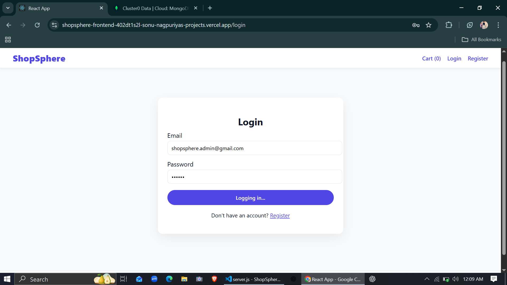

ShopSphere — Frontend

ShopSphere is a production-ready e-commerce frontend application built using React as part of a full MERN stack project.  
The application provides a clean, responsive, and user-friendly shopping experience with role-based access control.

---

## Live Application

The frontend application is deployed and publicly accessible.

*Live URL:*  
https://shopsphere-frontend-402dt1s2l-sonu-nagpuriyas-projects.vercel.app

---

## Tech Stack

- React
- React Router DOM
- Context API
- Axios
- CSS (inline style objects)

---

## Key Features

### User Features
- User registration and authentication
- Browse products with details view
- Shopping cart management
- Secure checkout flow
- Order history tracking

### Admin Features
- Admin authentication
- Product management (create, view, delete)
- Order monitoring and management
- Role-based route protection

---

## Application Structure
src/ ├── api/            # Axios client & API configuration ├── components/     # Reusable UI components & route guards ├── context/        # Auth & Cart context providers ├── pages/          # Application pages └── App.js          # Application routing & layout
Copy code

---

## Authentication & Authorization

- JWT-based authentication
- Protected routes for authenticated users
- Admin-only routes secured via role validation
- Axios interceptor to attach auth token on each request

---

## Environment Configuration

The frontend uses environment variables for backend communication.

Example:
REACT_APP_API_BASE_URL=<backend_api_url>
Copy code

---

## Status

This project is actively maintained and reflects real-world production practices, including deployment, authentication, and role-based access control.

---

## Screenshots

### Home Page

### Login Page

### Register Page

### Cart Page

### Admin – Add Product

## Author

*Sonu Nagpuriya*  
MERN Stack Developer